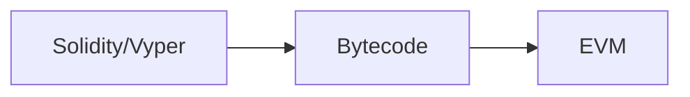

Acá comparto un breve tutorial que preparé para el curso "Criptomonedas y Contratos Inteligentes" de la PUC.

En este breve tutorial, exploraremos los conceptos básicos de Ethereum, Smart Contracts y Solidity, proporcionando ejemplos prácticos y consejos útiles.
## Altcoins

Luego de bitcoin, nacieron otras propuestas de blockchains, principalmente para usos específicos, por ejemplo Namecoin que busca ser una alternativa a los DNS.

Existen otras Altcoins como

- Litecoin
- Peercoin
- Dogecoin


## ¿Smart Contracts?

Un contrato inteligente es un programa que se ejecuta automáticamente en una blockchain cuando se cumplen condiciones preestablecidas.

## ETH, una plataforma Turing completa

Bitcoin script no es Turing completo, esto debido a que no tiene loops. 

Surge naturalmente la idea, en vez de crear criptomonedas nuevas para cada uso, ¿Qué tal si hacemos una Turing-completa.



Problema, ¿Como evitamos bucles?

Tenemos la idea de **Gas:**

Cada instrucción de la EVM tiene asociado un costo en gas.

Cada transacción tiene asociado un límite de gas a usar.

Los valores están en un anexo del [yellowpaper](https://ethereum.github.io/yellowpaper/paper.pdf) 
 de Ethereum.


**¿Que vale el gas?: Ether**

Cada transacción señala el valor que está dispuesto a pagar por gas, de manera similar a las fees en BitCoin.


Precios del gas:  [https://etherscan.io/gastracker](https://etherscan.io/gastracker)

**¿Que pasa si se acaba el gas?**

1. La transacción falla y se registra como transacción no exitosa en el blockchain.
2. Se revierten todos los cambios realizados por la transacción.
3. El minero cobra el gas gastado de igual manera.

## Ejemplo de un smart contract sencillo

El siguiente contrato solamente guarda una variable para que otro contrato pueda acceder a su valor.



// SPDX-License-Identifier: GPL-3.0
pragma solidity >=0.4.16 <0.9.0;

contract SimpleStorage {
    uint storedData;

    function set(uint x) public {
        storedData = x;
    }

    function get() public view returns (uint) {
        return storedData;
    }
}


Pueden encontrar más ejemplos y ejecutarlos en 

[Remix, un IDE web para Ethereum](https://remix.ethereum.org/)

## Ejemplos de uso

- DNS blockchain a lo Namecoin
- Ajedrez por correspondencia
- Muchas otras

## Diferencias con Bitcoin

- ETH guarda en la ledger los balances de cuentas, no las transacciones, como BitCoin.
- Esto es más costoso, requiere estructuras de datos más sofisticadas.
- Hace más fácil verificar el balance de una dirección, no tengo que leer toda la blockchain.
- Es más costoso en términos de espacio.
- Hace posible **Replay Attacks**
- Proof of work vs Proof of stake.

## Solidity

**Un lenguaje estáticamente-tipado para smart contracts sobre Ethereum**

Soporta herencia y tipos de datos definidos por el usuario

¿Como podemos armar smart contracts en solidity?

remix es un ide básico

Existen otras plataformas más sofisticadas como Truffle y Hardhat

## Anatomía de un contrato simple

```solidity
// SPDX-License-Identifier: MIT -Se suele especificar la licencia
pragma solidity ^0.8.0; 
//pragma señala la versión del compilador a usar, es importante declararla, para evitar //problemas con cambios backwards incompatibles 

contract SimpleCounter {
// Estado del contador
uint private count;
// Constructor para inicializar el contador
constructor() {
    count = 0;
}

// Función para incrementar el contador
function increment() public {
    count += 1;
}

// Función para obtener el valor actual del contador
function getCount() public view returns (uint) {
    return count;
}

}

```

Queremos un contrato que interactúe con SimpleCounter, que reciba una string, la almacene y llame a SimpleCounter para aumentar el contador.

La función increment es pública, se puede llamar desde cualquier lugar.

Por motivos de encapsulación nos gustaría tener una función que solamente pueda ser llamada desde otro contrato. Esto se llama external functions.

Podemos agregar el siguiente Código a SimpleCounter

```solidity
function externalIncrement() external {
    count += 1;
}
```

Ahora tenemos que escribir el contrato que llamara a la función externalIncrement() de SimpleCounter.

```solidity
// SPDX-License-Identifier: MIT
pragma solidity ^0.8.0;

interface ISimpleCounter {
function externalIncrement() external; //Definimos una interface para trabajar con 
// la función externalIncrement() de SimpleCounter
}

contract StringStorage {
string private storedString;
ISimpleCounter private counter;

constructor(address _counterAddress) {
    counter = ISimpleCounter(_counterAddress); 
 //el constructor de este contrato requiere que le pasemos la dirección de SimpleCounter
}

function storeStringAndIncrementCounter(string memory _stringToStore) public {
    storedString = _stringToStore;
    counter.externalIncrement(); //llamamos a SimpleCounter
}

function getStoredString() public view returns (string memory) {
    return storedString;
}
}
```

Ahora que pasa si en vez de querer que SimpleStorage guarde solamente la última string con que fue llamada, guarde todos los strings con que ha sido llamado

Podemos modificar SimpleStorage

```solidity
// SPDX-License-Identifier: MIT
pragma solidity ^0.8.0;

// Interfaz para interactuar con el contrato SimpleCounter
interface ISimpleCounter {
    function externalIncrement() external;
}

// Contrato para almacenar strings de texto y interactuar con SimpleCounter
contract StringStorage {
    // Array para almacenar múltiples strings de texto
    string[] private storedStrings;

    // Referencia al contrato SimpleCounter
    ISimpleCounter private counter;

    // Constructor para inicializar el contrato con la dirección de SimpleCounter
    constructor(address _counterAddress) {
        counter = ISimpleCounter(_counterAddress);
    }

    // Función para almacenar una nueva string de texto y incrementar el contador en SimpleCounter
    function storeStringAndIncrementCounter(string memory _stringToStore) public {
        // Añade la cadena al array
        storedStrings.push(_stringToStore);
        // Llama a la función externalIncrement en SimpleCounter
        counter.externalIncrement();
    }

    // Función para obtener todas las strings almacenadas
    function getAllStoredStrings() public view returns (string[] memory) {
        // Devuelve el array completo de cadenas
        return storedStrings;
    }
}
```

Ahora ¿Qué tal si queremos cobrar por almacenar estas strings en el contrato?

Agregamos variables para el precio y el propietario

```jsx
// Variable para almacenar el precio de almacenar un string
uint256 public priceToStore;
// Variable para almacenar la dirección del propietario del contrato
address public owner;
```

Modificamos el constructor

```jsx
// Constructor para inicializar el contrato con la dirección de SimpleCounter y el precio
constructor(address _counterAddress, uint256 _priceToStore) {
    counter = ISimpleCounter(_counterAddress);
    priceToStore = _priceToStore;
    owner = msg.sender; // Establece al creador del contrato como propietario
}
```

Hacemos payable **`storeStringAndIncrementCounter`**

```jsx
function storeStringAndIncrementCounter(string memory _stringToStore) public payable {
    require(msg.value == priceToStore, "Incorrect amount of Ether sent");
    storedStrings.push(_stringToStore);
    counter.externalIncrement();
}
```

No olvidar agregar una función para retirar los fondos almacenados en el contrato

```jsx
// Función para permitir el retiro de fondos del contrato
function withdraw() public {
    require(msg.sender == owner, "Only the owner can withdraw funds");
    payable(owner).transfer(address(this).balance);
}
```

El codigo final queda 

```jsx
// SPDX-License-Identifier: MIT
pragma solidity ^0.8.0;

// Interfaz para interactuar con el contrato SimpleCounter
interface ISimpleCounter {
    function externalIncrement() external;
}

// Contrato para almacenar strings y interactuar con SimpleCounter
contract StringStorage {
    string[] private storedStrings;
    ISimpleCounter private counter;

    // Precio para almacenar un string
    uint256 public priceToStore;

    // Dirección del propietario del contrato
    address public owner;

    // Constructor para inicializar el contrato con la dirección de SimpleCounter y el precio
    constructor(address _counterAddress, uint256 _priceToStore) {
        counter = ISimpleCounter(_counterAddress);
        priceToStore = _priceToStore;
        owner = msg.sender; // Establece al creador del contrato como propietario
    }

    // Función para almacenar un string y pagar una tarifa
    function storeStringAndIncrementCounter(string memory _stringToStore) public payable {
        require(msg.value == priceToStore, "Incorrect amount of Ether sent");
        storedStrings.push(_stringToStore);
        counter.externalIncrement();
    }

    // Función para obtener todas los strings almacenados
    function getAllStoredStrings() public view returns (string[] memory) {
        return storedStrings;
    }

    // Función para permitir al propietario retirar los fondos del contrato
    function withdraw() public {
        require(msg.sender == owner, "Only the owner can withdraw funds");
        payable(owner).transfer(address(this).balance);
    }
}
```

## Referencias útiles

Para más información, puede ser útil el capítulo 7 del libro Mastering Ethereum de Antonopoulos Wood. Además de la documentación de Solidity en [https://docs.soliditylang.org](https://docs.soliditylang.org/)

Otra referencia es el libro Solidity Programming Essentials de Ritesh Modi.

[https://solidity-by-example.org/](https://solidity-by-example.org/hello-world/)

[https://cryptozombies.io/en/course](https://cryptozombies.io/en/course) es un curso corto para aprender solidity mientras diseñas un juego de zombies.

**Ideas de proyectos**

1. Votación electronica
2. Democracia Líquida (Voto delegable)
3. Loterías/Rifas 
4. DAO
5. Canal de Pagos
6. Splitwise sobre blockchain ([https://cs251.stanford.edu/hw/proj3.pdf](https://cs251.stanford.edu/hw/proj3.pdf))
7. Exchange descentralizado de tokens ([https://cs251.stanford.edu/hw/proj4.pdf](https://cs251.stanford.edu/hw/proj4.pdf))
8. Tu propia idea
